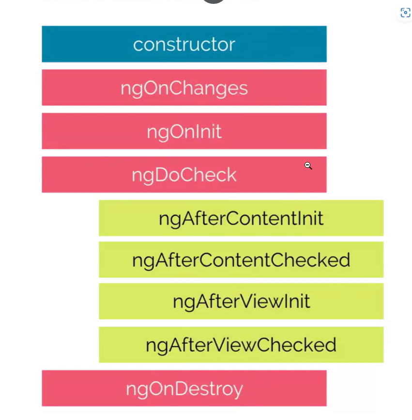

npm i bootstrap

// Configurar bootstrap en angular.json

ng g c components/students-list

ng g c pages/student-page

// Dentro de la student page, muestro la student list, quiero mostrar el array de estudiantes de student-page.ts 

@Input decorador que le indica a Angular que ese componente va a recibir los datos de un componente Padre. Permite crear componentes reutilizables.

Quiero usar <app-students-list />, 2 veces distintas, para mostrar listas distintas. Una con los estudiantes aprbados y la otra con los desaprobados

WTF hay una extension para tener integrado drawio en VSCode

El decorador @Input se escribe en el componente hijo, porque es este el que recibe la lista que le envia el componente padre

app -> student page -> student list

La página de estudiantes renderiza las listas

Que pasaria si students list quiere avisarle a students page que algo ha ocurrido, un evento o lo que sea?

Decorador @Output, tambien se usa en el componente hijo. Porque es este el que indica que info va a recibir, y que eventos QUIERE EMITIR. 

El decorador viewChild, permite acceder desde el .ts a cualquier elemento o componente que esté renderizado en el html de ese componente donde usé view child. Está pensado para usarse en los componentes padre. @ViewChild recibe un selector

Ciclos de vida de un componente de Angular 

El primer metodo que se dispara de todo componente es su constructor, porque los componentes de Angular son Clases, y pasa siempre antes de inicializarse por su metodo constructor.

Ahora, el que vamos a usar es afterViewInit, este se dispra, despues que la vista se ha inicializado. 

Estoy recibiendo un undefined, porque estoy haciendo un console log, de un elemento de la vista, antes de que se inicialize, en el constructor lo estoy haciendo. Y no existe ahi esa referencia. Entonces ¿Como utilizo el ciclo de vida?

Hay una Interfaz que puedo aplicar a la clase, 

ng g interface models/nombreInterface

ng g c components/my-modal

¿Como hago para saber cuando tiene que mostrarse o no el modal?

