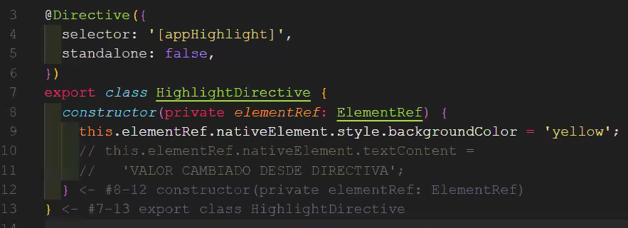

```
nvm use 22.13.0
cd clase08
npm i
ng serve
```
git clean -fdx

Generar un modulo shared
y ahí generar un pipe. Los pipes cómo los componentes tienen que estar en un módulo
Los pipes tmb tienen archivos de prueba y se pueden evitar

`ng g module shared`
`ng g pipe shared/pipes/fullName --skip-tests --standalone-false`
`ng g pipe shared/pipes/fullName2 --skip-tests --standalone-false`

`ng g directive shared/directives/highlight --skip-tests`

Todos los componentes tienen ciclos de vida

El hecho de querer cambiar el valor de esa propiedad por medio de html, ya no es cuando se instancia el objeto, es cuando se renderiza el contenido

Lo que yo quiero hacer seria el ciclo d vida changes
El color verde lo recibo en el ciclo de vida onChanges, cuando ocurre un cambio con las propiedades Input de la directiva

Las directivas reciben input y output. son parecidas a los componentes

No entiendo porque hay que ponerlo con [] [bolder]="true". No sé porque sin las [] no lo entiende

Directivas estructurales personalizadas

`ng g directive shared/directives/multiply --skip-tests`

la creacion de estas directivas estructurales es la misma que las directivas normales. Solo que para usarse, deben ir con un \* adelante, como si fuera una nativa

Angular no avisaba que esa directiva no estaba siendo exportada

El elemento se muestra por defecto primero 10 veces, y luego tora 10 porque estaba harcodeado en el for

Las directivas son para manipular el elemento html, y los pipes para manipular el contenido.
Aunque con las directivas, cómo manipulo el DOM, puedo modificar el innerContent, textContent, etc  

Con esto nada más se puede hacer una directiva, de está manera aplico la directiva a secas, y ya funciona


Se complica cuando quiero recibir argumentos en la directiva

  appHighlight="green" 
 no va entre [], porque el valor que recibe es un string

 [bolder]="true", debe ir entre [], porque asi angular, va a interpretar lo que está dentro de las "", como JAVASCRIPT. 


 Si pusiera texto, buscaria una variable que no va a encontrar, 

y para que no de error deberia ir "''"
  [appHighlight]="'green'" 

Cuando yo defino que la directiva, puede recibir la propiedad appHighlight y bolder

<h1
  appHighlight
  *appMultiply="5"
  (colorUpdated)="onColorUpdated()"
  [bolder]="true"
  [colorHighlight]="'green'"
>

TENGO QUE APLICAR LA DIRECTIVA, PARA QUE ME PERMITA ENVIAR LOS OTROS DATOS, SI NO, ME DA ERROR PORQUE NO ESTOY APLICANDO LA DIRECTIVA.
APLICAR LA DIRECTIVA ME PERMITE ENVIAR ESOS DATOS


Las directivas pueden emitir eventos
Puedo usar @output para notificar al componente que está renderizando la directiva que ocurrió algo dentro de la directiva


01:09:00