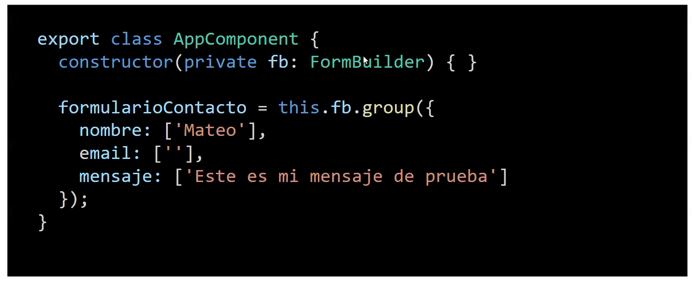

La linea 2, es inyeccion de dependencias del FormBuilder, permite definir un grupo de controles, estos son cada uno de los inputs que estan en mi formulario.
Cada uno define un campo del formulario, pueden tener valores por defecto o no. Esto es definir un formulario del lado del .ts, despues hay que comunicarlo con el html

ng g c components/template-driven --standalone=false

ng g c components/reactive-forms --standalone=false

El paquete de formularios viene instalado pero no importado.

Esto para reactive forms:
import { ReactiveFormsModule } from "@angular/forms"

@NgModule({
...,
imports: [ReactiveFormsModule],
...  
})

El modelo de formulario se define en el .ts

Se define casi todo en el .ts

Los formularios deben estar validados, es una mala practica que no lo esten

Los formularios en Angular tienen una propiedad para consultar si el usuario interactuó con el campo al menos

Forma 2: Validando si tocó o no el campo

[ngClass]="
loginForm.get('emailFB')?.touched
? loginForm.get('emailFB')?.valid
    ? 'is-valid'
    : 'is-invalid'
  : ''
"

Si fue tocado, entra a la 2da condicion. Si no fue tocado, no aplica ninguna clase: ''
Si el email es valido, aplica la 1era clase 'is-valid', si no aplica la 'is-invalid'

// TEMPLATE DRIVEN
Para trabajar con template driven tengo que definir un modelo de formulario 

Ya lo enlacé correctamente cómo hago validaciones ahora? 

En Template Driven las validaciones se hacen en .html

Tengo que usar expresiones regulares en el atributo pattern para hacer validaciones en el campo

¿Cómo se si las validaciones estan funcionando?

Debo/puedo extraer una referencia al control del input, dentro de ese mismo input 

#emailControl="ngModel"

Así se extrae el control que está siendo controlado por ese ngModel

Despues lo imprimo:
{{emailControl.valid}}

Template Driven se está dejando de usar. Porque todo es mas dificil y engorroso
Las validaciones personalizadas se complican, todo en el html se hace eterno. 

Falta evento submit en TD Y RF