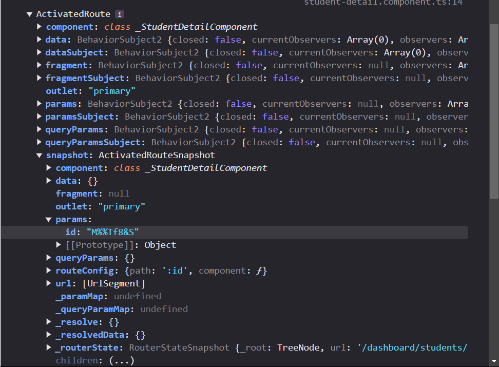

```bash
nvm use  22.13.0
cd clase15
npm i
ng serve
```

Metodologias de Testing

TDD | BDD
TDD es la que vamos a usar
Testing Driven Development
1. Definimos los objetivos y escribimos su posible implementación.
2. Programamos el código para pasar las pruebas.
3. Podemos añadir nuevos casos de uso y refactorizar nuestro código.

BDD
Behavior Driven Development
No es una estrategia de testing si no una metodologia de desarrollo

Distintas formas de hacer testing
| End to End | Integración | Unitarias |
| ---------- | ----------- | --------- |

las primeras 2 no son tan necesarias si tengo unas buenas pruebas unitarias

Lo mas optimo es testear los componentes/funciones más importantes y vitales de mi aplicación

Todos los recursos externos al componente debería tratar de mockearse en la prueba unitaria para no tener que hacer consultas externas. 

En el ambiente del testing.
Testear el componente.html y el componente.ts es una prueba de integración. Porque estoy probando cómo se integra el .ts en mi .html
En realidad son componentes separados. Pero no vamos a hacer este tipo de pruebas, sólo del .ts

Por defecto Angular trae instalado y pre configurado Jasmine y Karma


Estas librerias buscan dentro de mi proyecto archivos que terminen en .spec.ts, si no, no lo van a testear

Angular CLI  tiene un comando para los tests. Con este comando
```bash 
ng test
```

Al correr este comando, se despliega un servidor de Karma, en donde se abre en el navegador una pestaña mas amigable con los errores/cosas de los tests



 


01:02:00