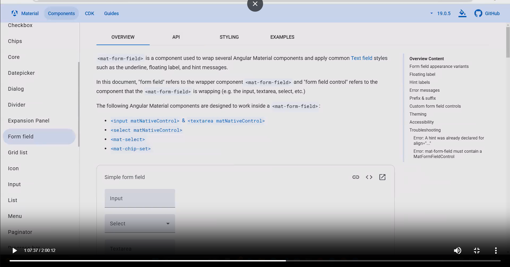

`git clean -fdx`

ng new clase07 --no-standalone
ng add @angular/material
Enter, enter,
instalar X version: SÍ
Elegir el tema custom

https://material.angular.io/

Packages successfully installed.
? Choose a prebuilt theme name, or "custom" for a custom theme: Custom
? Set up global Angular Material typography styles? Yes
? Include the Angular animations module? Include and enable animations

Sidenav

Modules/dashboard carpeta encargada de administrar todo lo relacionado a cursos/alumnos

ng g module modules/dashboard --routing
(por ahora routing no se usa)

`ng g module modules/auth --routing`

Los módulos son cajas que agrupan componentes y funcionalidades. Para separar la ap en partes mas pequeñas
"dashboard" > panel administrativo, de control
dashboard > students.component & courses.component

Auth module > autenticacion
login & register

`ng g component modules/dashboard --skip-tests`

`ng g component modules/auth/login --skip-tests`

dashboard.component va a tener todo el encapsulamiento de la app

https://material.angular.io/components/sidenav/overview

Si creo un componente con el nombre/ruta incorrecto y lo elimino, tengo que borrarlo de donde se importó tambien porque va a dar error.

estoy intentando mostrar el app-dashboard, en el app-module. Pero app-dashboard pertenece a dashboard-module. Si no importo correctamente dashboard-module en app-module, no voy a poder usarlo

1° Importar en el módulo padre el modulo hijo en el array de imports
2° En el modúlo hijo, en el array declarations[] y exports[] tengo que escribir el/los Componentes a exportar.

Todos los componentes de angular tienen modulos que debo importar para usarlos
y escribirlos en el array imports

Los botones del sidenav no se ven cómo de Material porque los botones son un componente, y no los estoy importando.

https://material.angular.io/components/button/api
https://material.angular.io/components/toolbar/api

El toolbar va a ir dentro del area de contenido.

Al traer toolbar de error por la importacion de iconos, los iconos deben traerse

`ng g component modules/dashboard/components/toolbar --skip-tests`

La vista es la misma pero mas limpio el código html

"Lazy loading" mejora el rendimiento. Hace que las cosas se carguen por demanda

Quiero que el sidenav se abra cuando hago click en el boton del toolbar.

De acá a linea 18 dashboard.component.html

En toolbar uso @output

A cada page le voy a crear un modulo

`ng g module modules/dashboard/pages/students --routing`

`ng g module modules/dashboard/pages/home --routing`

`ng g module modules/dashboard/pages/courses --routing`

`ng g module modules/dashboard/pages/enrollments --routing`

`ng g component modules/dashboard/pages/students --skip-tests`

Ahora quiero mostrar el app-students, en el dashboard.component.html

Los iconos de angular material estan basados en los iconos de google

Mi angular material no está funcionando bien. Los íconos y los botones

https://material.angular.io/components/form-field/api
https://material.angular.io/components/input/api

Algo en serio no está funcionando de Material

`ng g module modules/dashboard --routing
ng g module modules/auth --routing
ng g component modules/dashboard --skip-tests --standalone=false
ng g component modules/auth/login --skip-tests --standalone=false
ng g component modules/dashboard/components/toolbar --skip-tests --standalone=false
ng g module modules/dashboard/pages/students --routing
ng g module modules/dashboard/pages/home --routing
ng g module modules/dashboard/pages/courses --routing
ng g module modules/dashboard/pages/enrollments --routing
ng g component modules/dashboard/pages/students --skip-tests --standalone=false
`

https://developer.mozilla.org/es/docs/Web/JavaScript/Reference/Global_Objects/Array/filter

el toolbar y el side nav siempre estan presentes en la página, nunca se van. lo unico que cambia es el contenido.1

todos los demas módulos y cosas que creó, son lo que se va a mostrar en el area de contenido
