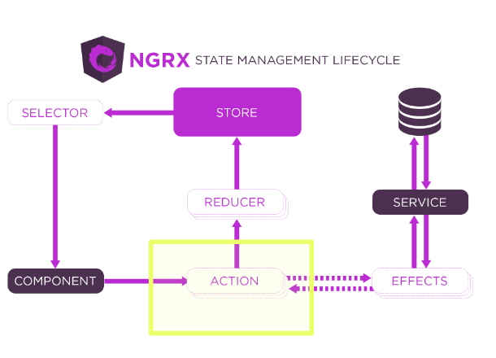
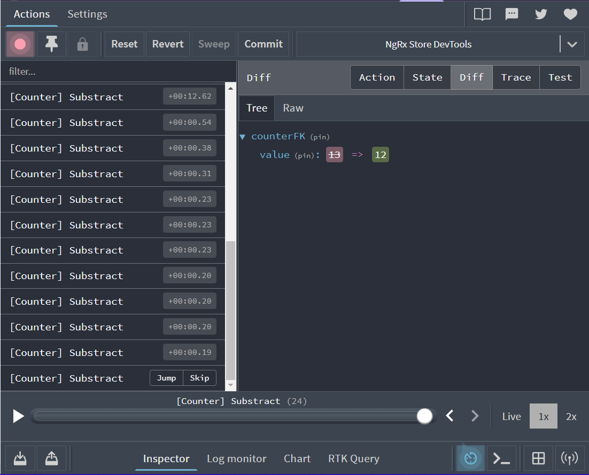

```bash
nvm use  22.13.0
cd clase16
npm i
ng serve
```
Redux es un patrón de diseño que no es exlusivo a Angular, sino que es posible usarse en React.js, etc 


Patron Redux con:

### NgRx "framework"
- State
  
Contenedor que controla el estado de mi aplicacion.
Con el patron redux, vamos a almacenar en un estado global, cómo se encuentran los datos que se estan mostrando en pantalla, o cual es el estado de determinadas variables en determinado momento. Espacion en memoria usado para cargar info.

- Effects
  
Permiten controlar acciones asincronas, cada vez que yo quiera modificar el estado de mi aplicacion con una accion asincronca, vamos a usar un effect

- Router-Store

funcionalidad que permite controlar el router  de angular desde las acciones de redux. esta mencionada porque es parte de la libreria pero no se va a usar en el curso 

- Store Dev-Tool

```bash
ng add @ngrx/store
```

En la carpeta `store/index.ts`
Vamos a definir un par de cosas:

```ts
import { ActionReducerMap } from "@ngrx/store";
export interface RootState {}
export const rootReducer: ActionReducerMap<RootState> = []
```
```ts
  imports: [
    StoreModule.forRoot(rootReducer, {}), // se agrega
  ],
```


Ahora hay que definir un conjunto de definiciones que tienen que ver con Acciones, Reducers y Selectores 

**No incluir el contador en el proyecto final**

`store/counter.selector.ts`

Acciones: Son eventos que ocurren durante la ejecucion de la aplicación que permiten al usuario interactuar con la app. Una accion puede ser Sumar 

Aasique creamos la accion sumar
`store/counter.actions.ts`
```ts
import { createAction } from "@ngrx/store";
// export const add = createAction('[Contexto] Accion')
export const add = createAction('[Counter] Add')
export const substract = createAction('[Counter] Substract')
```

Las acciones no basta con crearlas,tengo que hacer una implementación que me permite hacer una suma o resta. Las acciones se controlan por medio de una funcion reductora o reducer :

```bash
store/counter.reducer.ts
```
Acá defino que datos voy a alojar en el estado de mi aplicacion.

Defino acciones, y con el reducer defino que hacer con las acciones de la app

Hay que conectar el `reducer` con el `rootReducer`

```ts
// Estado del contador
import { createReducer, on } from "@ngrx/store";
import { add, substract } from "./counter.actions";

// va a ser una clave con la que mas adelante vamos a referenciar al counterState 
export const counterFeatureKey = 'counter' // el nombre tiene que ser representativo al un conjunto de acciones y el estado que estamos almacenando

// Interfaz del estado
export interface CounterState {
    value: number;
}
// Estado inicial
const initialState: CounterState = {
    value: 0
}

// Funcion reductora 
export const counterReducer = createReducer(
    // Estado inicial
    initialState,
    // Atrapar las acciones
    // Cuando la accion sea agregar, va a ejecutar ese callback
    on(add, (ogState) => {
        // retorno un nuevo estado
        return {
            ...ogState,
            value: ogState.value + 1
        }
    }), // on recibe como primer argumento una accion, el 2° es un callback
    on(substract, (ogState) => {
        // retorno un nuevo estado
        return {
            ...ogState,
            value: ogState.value - 1
        }
    }) 
)
```

```bash
index.ts
```

```ts
import { counterFeatureKey, counterReducer, CounterState } from "./counter.reducer";

export interface RootState {
    [counterFeatureKey]: CounterState // Estoy definiendo la interfaz
}

export const rootReducer: ActionReducerMap<RootState> = {
    [counterFeatureKey]: counterReducer// Estoy definiendo el valor
}
```

Instalar devtool de redux para hacer debug
https://chromewebstore.google.com/detail/redux-devtools/lmhkpmbekcpmknklioeibfkpmmfibljd?hl=es
agrega un panel en la consola del navegador llamado redux

Agrega configuracion en `app.mopdule.ts`, que se puede personalizar. 
```bash
ng add @ngrx/store-devtools
```

Si puedo ver esto en la consola de redux, siginifica que la configuracion inicial está hecha


Hay que empezar a testear el contador 

```bash
ng g m modules/dashboard/pages/counter --routing
ng g c modules/dashboard/pages/counter --skip-tests --no-standalone
```
¿Cómo hago para disparar acciones desde un componente?
Cada vez que yo quiera modificar el estado de mi aplicación, según Redux tengo que ahcerlo mediante acciones. 

Mapa de flujo de datos de REDUX


Todo comienza a partir del Componente dispara una accion ej: sumar, luego el reducer filtra el tipo de accion y genera un nuevo estado, luego ese estado lo vuelve a almacenar en lo que se conoce como store o tienda. ¿Que es eso? Es un espacio en memoria que está alojado a nivel global en la aplicación, al cúal yo le puedo consultar luego la info, se guarda la info que modifica el reducer, el estado del contador y todo lo que se cargue.  Luego mediante un selector podemos consultar esa info desde el componente 

A la parte de los efecto por ahora no se mira



¿Cómo consulto el dato que se está modificando?

El store de Redux usa rxjs, la liberia que usamos para los observables

No es recomendable suscribirse al store, porque actualmente solo tengo los datos del contacdor. Pero yo puedo tener almacenado el login del usuario, una lista de usuarios, un listado de paises, cualquier cosa.
Entonces si hubiera un cambio en alguna lista, estaría disparandose una emisión en el contador, y al contador que sólo renderiza un nro, no le interesa lalista de estudiantes 

Para eso existen los `selectores`
Son funciones puras que se utilizan para que se utilizan para obtener parte del store que está alojado en la tienda. Permite recortar lo que me interese pereguntar 

Las distintas suscripciones que  estoy manejando en `counter.compnent.ts`, necesitarian un onDestroy, almacenar el valor en una variable, etc. Mucho trabajo. 

El pipe async no funciona 


`auth.service.ts`
Tiene una base de datos con usuarios falsos, y el método login consultaba esa bdd buscando alguna coincidencia donde el email que se recibe del form sea === a uno de los usuarios almacenados, lo mismo con la password 
Si el login era correcto almacenaba un token en el local sotrage


01:54:00