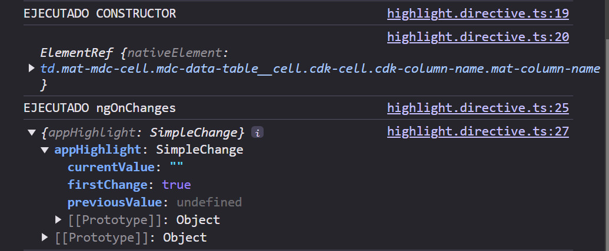

```bash
nvm use  22.13.0
cd clase09
ng serve
npm i
```

Angular permite hacer aplicaciones SPA, osea que las rutas/navegacion y los componentes los renderiza JavaScript. Para eso voy a usar el router de Angular



El componente <app-dashboard /> , app.component.html estaba hardcodeado, sin importar las rutas que defina, si eso está ahí hardcodeado siempre se va a ver lo mismo. Y no va a dar error, pero no van a funcionar las rutas.

Para que las rutas que yo definí funcionen, debo usar:
<router-outlet/>
En app.c.html

Lo que va a hacer, es mostrar el contenido, segun las rutas definidas en el arbol de rutas (array Routes de app-routing.module). Busca y funciona en base a lo definido en los objetos

Para cuando el usuario ingresa cualquier path que no esté definido en el array Routes, debo usar:

```html
{ path: '**', redirectTo: 'auth/login' },
```

Rutas como:
`dashboard/inscripciones
dashboard/cursos`
Son rutas hijas del dashboard, porque el `/dashboard` es parte de la ruta que las contiene

// El método load children es para cargar rutas hijas que están alojadas en otro módulo. En este caso la que estan en el `dashboard-routing.module`.ts

`    loadChildren: () => import('./modules/dashboard/dashboard.module') // devuelve una promesa`

Cuando la ruta sea `'dashboard'`, va a cargar el `DashboardComponent` y tambien va a cargar las rutas hijas definidas en el ./modules/dashboard/dashboard.module .

Porque el `DashboardModule`, tiene importado el `DashboardRoutingModule`, el cúal tiene la configuracion de las rutas hijas del dashboard

`{
path: 'dashboard',
component: DashboardComponent,
loadChildren: () =>
import('./modules/dashboard/dashboard.module').then(
(dashMod) => dashMod.DashboardModule
),
},`

Cada una de las pages representan una ruta dentro de dashboard


El `DashboardRoutingModule` es el archivo de configuracion de rutas hijas 

En `dashboard-routing.module`, todas las rutas que yo configure tienen de base la ruta /dashboard/ , son .forChild

`ng g c modules/dashboard/pages/home --skip-tests --no-standalone`

Por el 'lazy loading'   que vamos a ver más adelante hace eso en el `dashboard-routing.module`

No define un component, si no un loadChildren

Luego de realizar la configuracion en `dashboard-routing.module`:
`const routes: Routes = [
  {
    path: 'home',
    loadChildren: () => import('./pages/home/home.module').then((homeMod) => homeMod.HomeModule),
  }
];`

Hay que configurar el ¡**`home-routing.module.ts`**!

A pesar de que yo tengo las rutas bien definidas, no tengo errores ni nada, en todas las rutas veo el componente estudiantes en todas las rutas.
Es porque está hardcodeado en el html de dashboard.


00:37:00